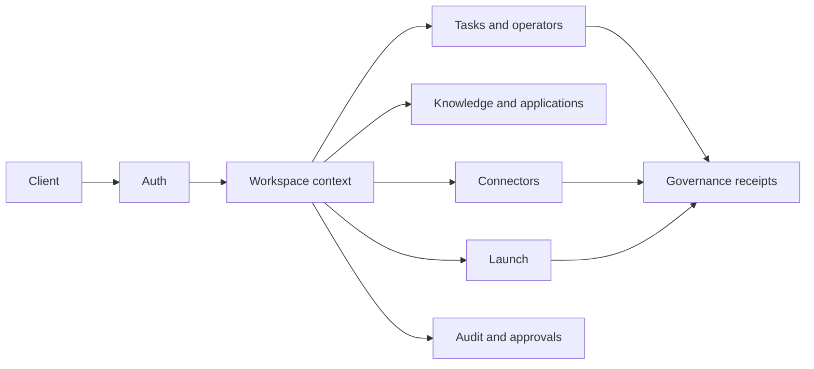

# Pilot API Reference

Base URL: `http://localhost:3100` (or your deployed gateway URL)

## Audience

Use this page if you are writing a client, testing a self-hosted deployment, wiring a connector, or auditing API behavior. It is a public reference hub for routes, auth, workspace context, payload shapes, job surfaces, receipts, and diagnostics.

## Outcome

After this page you should be able to:

- authenticate with email, Telegram, or API keys;
- pass workspace context correctly;
- use tasks, operators, knowledge, applications, connectors, launch, YC ingestion, and audit endpoints;
- understand where HELM governance receipts appear;
- collect useful diagnostics when an API call fails.

## API Surface Map



## Source Truth

Route behavior is backed by `services/gateway/src/routes/`, Zod payloads and shared types in `packages/shared/`, database domains in `packages/db/src/schema/`, and HELM receipt wiring in `packages/helm-client/`. If a route description differs from code or tests, update this file.

## Authentication

All protected endpoints require one of:

- **Bearer token:** `Authorization: Bearer <session-token>`
- **API key:** `X-API-Key: hp_<key>`
- **Workspace context:** authenticated non-auth routes should also include `X-Workspace-Id: <workspace-id>` when the workspace is not already encoded in the path.

Session tokens are obtained via `/api/auth/email/request` + `/api/auth/email/verify` or `/api/auth/telegram`.

Session tokens rotate automatically after 24 hours — check the `X-New-Token` response header.

---

## Auth

### POST /api/auth/email/request

Request a magic link code.

```json
{ "email": "you@example.com" }
```

Response: `{ "sent": true, "email": "...", "code": "123456" }` (code only in dev mode)

### POST /api/auth/email/verify

Verify magic link code and get a session.

```json
{ "email": "you@example.com", "code": "123456" }
```

Response: `{ "token": "...", "user": { "id", "name", "email" }, "workspace": { "id", "name" } }`

### POST /api/auth/telegram

Authenticate via Telegram Web App initData.

```json
{ "initData": "<telegram-web-app-init-data>" }
```

### POST /api/auth/apikey

Create an API key (requires auth).

```json
{ "name": "my-key" }
```

Response: `{ "key": "hp_...", "name": "...", "expiresAt": "..." }`

### DELETE /api/auth/session

Logout / invalidate current session.

### POST /api/auth/invite/:token

Accept a workspace invite.

```json
{ "email": "you@example.com" }
```

---

## Workspace

### GET /api/workspace/:id

Get workspace details with members.

### GET /api/workspace/:id/settings

Get workspace settings (policy, budget, model config).

### PUT /api/workspace/:id/settings

Update workspace settings.

```json
{
  "policyConfig": { "maxIterationBudget": 50, "blockedTools": [] },
  "budgetConfig": { "monthlyLlmBudget": 100, "currency": "USD" },
  "modelConfig": {
    "provider": "openrouter",
    "model": "anthropic/claude-sonnet-4-20250514",
    "temperature": 0.7
  }
}
```

### PUT /api/workspace/:id/mode

Switch workspace mode.

```json
{ "mode": "discover" }
```

Valid modes: `discover`, `decide`, `build`, `launch`, `apply`

### POST /api/workspace/:id/invite

Generate invite link.

```json
{ "role": "member", "email": "partner@example.com" }
```

Response: `{ "inviteUrl": "...", "inviteToken": "...", "role": "member", "expiresIn": "7 days" }`

---

## Opportunities

### GET /api/opportunities

List opportunities. Query: `?workspaceId=...`

### POST /api/opportunities

Create an opportunity.

```json
{ "title": "...", "description": "...", "source": "manual", "workspaceId": "..." }
```

### POST /api/opportunities/:id/score

Enqueue opportunity scoring job.

---

## Tasks

### GET /api/tasks

List tasks. Query: `?workspaceId=...`

### POST /api/tasks

Create a task.

```json
{ "title": "...", "description": "...", "workspaceId": "..." }
```

### PUT /api/tasks/:id/status

Update task status.

```json
{ "status": "queued" }
```

---

## Operators

### GET /api/operators

List operators. Query: `?workspaceId=...`

### POST /api/operators

Create an operator.

```json
{ "name": "...", "role": "cto", "goal": "...", "workspaceId": "..." }
```

### PUT /api/operators/:id

Update operator (goal, isActive).

### GET /api/operators/roles

List available operator role definitions.

---

## Knowledge

### GET /api/knowledge/search

Search knowledge base. Query: `?q=...&limit=20`

### POST /api/knowledge/pages

Create a knowledge page.

```json
{ "title": "...", "content": "...", "type": "note", "workspaceId": "..." }
```

---

## Applications

### GET /api/applications

List applications. Query: `?workspaceId=...`

### POST /api/applications

Create an application.

```json
{ "name": "YC S26", "program": "yc", "deadline": "2026-06-01", "workspaceId": "..." }
```

### GET /api/applications/:id

Get application with drafts and artifacts.

### PUT /api/applications/:id/drafts

Upsert a draft section.

```json
{ "section": "Company Description", "content": "..." }
```

### PUT /api/applications/:id/status

Update application status.

```json
{ "status": "submitted" }
```

---

## Audit

### GET /api/audit

List audit log entries. Query: `?workspaceId=...&limit=50`

### GET /api/audit/approvals

List approvals. Query: `?workspaceId=...&status=pending`

### PUT /api/audit/approvals/:id

Resolve an approval.

```json
{ "action": "approve", "resolvedBy": "user-id" }
```

### GET /api/audit/violations

List policy violations. Query: `?workspaceId=...`

---

## Connectors

### GET /api/connectors

List available connectors.

### GET /api/connectors/grants

List workspace grants. Query: `?workspaceId=...`

### POST /api/connectors/:name/grant

Grant a connector to workspace.

```json
{ "workspaceId": "...", "scopes": ["repo", "user"] }
```

### DELETE /api/connectors/:name/grant

Revoke a connector grant.

```json
{ "workspaceId": "..." }
```

### POST /api/connectors/:name/token

Store a connector token (encrypted at rest).

```json
{ "grantId": "...", "accessToken": "...", "refreshToken": "..." }
```

### POST /api/connectors/:name/session

Store an encrypted browser session snapshot for a session-auth connector such as `yc`.

```json
{
  "grantId": "...",
  "sessionData": { "cookies": [], "origins": [] },
  "sessionType": "storage_state"
}
```

### POST /api/connectors/:name/session/validate

Validate a previously stored session and queue a private sync/validation run when needed.

```json
{ "grantId": "...", "workspaceId": "..." }
```

### DELETE /api/connectors/:name/session

Delete a stored browser session for the connector grant.

```json
{ "grantId": "..." }
```

### GET /api/connectors/:name

Get connector status for the current workspace, including `hasSession`, `lastValidatedAt`, and `connectionState`.

---

## Launch

### GET /api/launch/targets

---

## YC Intelligence

### POST /api/yc/ingestion/public

Queue a public YC ingestion run.

```json
{ "workspaceId": "...", "source": "companies|startup_school", "limit": 50 }
```

### POST /api/yc/ingestion/private

Queue a private YC session-backed run, typically for cofounder matching sync.

```json
{ "workspaceId": "...", "grantId": "...", "action": "validate|sync", "limit": 25 }
```

### POST /api/yc/ingestion/replay

Replay a previously stored raw capture through the parser.

```json
{
  "workspaceId": "...",
  "source": "companies|startup_school",
  "replayPath": "/abs/path/to/capture.json"
}
```

### GET /api/yc/ingestion/history

List recent ingestion records for the current workspace. Records include replay tracking fields when migration `0017_ingestion_replay_columns` has been applied:

- `replayCount`: number of operator-triggered parser replays for the stored capture.
- `lastReplayedAt`: timestamp of the most recent replay, or `null`.

### GET /api/yc/ingestion/:id

Get a single ingestion record with status, counts, provenance, replay counters, and errors.
List deploy targets. Query: `?workspaceId=...`

### POST /api/launch/targets

Create a deploy target.

### GET /api/launch/deployments

List deployments. Query: `?workspaceId=...`

### POST /api/launch/deployments

Record a deployment.

### PUT /api/launch/deployments/:id/status

Update deployment status.

### POST /api/launch/deployments/:id/health

Record a health check.

---

## Other

### GET /api/founder/profile

Get founder profile.

### GET /api/yc/companies

Search YC companies. Query: `?q=...`

### GET /api/product/modes

List product modes.

### GET /api/events

List timeline events. Query: `?workspaceId=...`

### GET /api/capabilities

Return the Gate 0 capability registry and summary used to control production-readiness claims.

Response: `{ "summary": { "total": 18, "productionReady": 0, "byState": { ... } }, "capabilities": [...] }`

### GET /api/capabilities/:key

Return one capability state, blockers, evidence notes, owner, and required eval gate.

### GET /api/command-center

Return the Gate 8 command-center aggregate for the authenticated workspace. Requires at least the workspace `partner` role. The response includes capability truth, real durable task/task-run/action/tool-execution/receipt/approval/audit/browser/computer/handoff/artifact rows, and a runtime-truth statement that keeps mission autonomy blocked until eval-backed promotion.

### GET /api/command-center/replay?ref=...

Resolve a workspace-scoped replay reference to linked `evidence_items`, browser observations, and computer actions. Requires at least the workspace `partner` role and does not promote any replay capability to `production_ready`.

### GET /api/command-center/permission-graph

Return a read-only workspace permission graph for the command center. Requires at least the workspace `partner` role. The graph includes workspace role, member, operator, tool-scope, policy-config-key, and governance capability edges while withholding raw user IDs, raw policy values, and sensitive tool/config strings. This is not a production-ready delegation control plane.

### GET /api/command-center/mission-graph

Return a read-only durable mission graph for the command center. Optional query: `?missionId=...`. Requires at least the workspace `partner` role. The response is backed by `missions`, `mission_nodes`, `mission_edges`, `mission_tasks`, and mission checkpoint/recovery-plan/recovery-apply/rollback `evidence_items` rows, ordered deterministically, and does not dispatch, apply recovery, roll back, or resume the mission DAG.

### GET /api/command-center/eval-status

Return read-only production eval status for the command center. Requires at least the workspace `partner` role. The response includes registered eval scenarios, recent workspace `eval_runs`, linked `eval_results`, `eval_steps`, `eval_evidence_links`, promotion-eligibility rows from `capability_promotions`, and the promotion rule; it never mutates the capability registry or marks a capability `production_ready`.

### GET /api/command-center/computer-actions/replay

Return an ordered safe-computer action replay sequence for the authenticated workspace. Optional query: `?taskId=...`. Requires at least the workspace `partner` role. Output is bounded to redacted stdout/stderr/file-diff previews and redacted metadata.

### GET /api/command-center/proof-dag/:taskRunId

Return a workspace-scoped proof DAG for a parent or subagent task run. Requires at least the workspace `partner` role. The response includes related task_run lineage rows, agent handoffs, evidence packs, capability truth, and blockers. It is an inspection route only; it does not promote `subagent_lineage` or `command_center` to `production_ready`.

### GET /api/browser-sessions/:sessionId/replay

Return an ordered browser read/extract observation replay sequence for one browser session in the authenticated workspace. Requires at least the workspace `partner` role. Output uses redacted DOM snapshots and extracted data only; it must not expose cookies, passwords, tokens, or browser profile exports.

### GET /api/startup-lifecycle/templates

Return the Gate 9 startup lifecycle template set for the authenticated workspace. Requires at least the workspace `partner` role and returns capability truth with the template node contracts.

### POST /api/startup-lifecycle/compile

Compile a founder goal into a non-production governed lifecycle DAG draft. Requires at least the workspace `partner` role. The response is `compiled_not_persisted`, includes required agents, skills, tools, evidence, HELM policy classes, escalation conditions, and acceptance criteria, and never starts execution.

### POST /api/startup-lifecycle/persist

Compile and persist a founder goal as durable venture, goal, mission, mission node, mission edge, and optional task rows. Requires at least the workspace `partner` role. The response is `persisted_not_executing`; this route does not dispatch agents, call tools, perform external actions, or promote `startup_lifecycle` to `production_ready`.

### POST /api/startup-lifecycle/missions/:missionId/schedule

Inspect a persisted lifecycle mission, identify dependency-ready pending nodes, mark those nodes `ready`, and return linked task IDs. Requires at least the workspace `partner` role. The response is `scheduled_not_executing`; this route does not call the orchestrator, dispatch agents, start browser/computer sessions, or promote mission runtime to `production_ready`.

### POST /api/startup-lifecycle/missions/:missionId/checkpoint

Persist a redacted snapshot of the current mission, node, edge, and task-link state as `startup_lifecycle_mission_checkpoint` evidence and a linked `manual_checkpoint` row in `mission_runtime_checkpoints`. Requires at least the workspace `partner` role. The response is `checkpointed_not_recovered` and includes both the evidence-style `checkpointId` and durable `runtimeCheckpointId`; this route records the replayable checkpoint snapshot and latest checkpoint pointer on the mission, but it does not itself recover, roll back, continue execution, or promote mission runtime to `production_ready`.

### POST /api/startup-lifecycle/missions/:missionId/recovery-plan

Compare the latest mission checkpoint snapshot with current mission, node, edge, and task-link state, then persist a `startup_lifecycle_recovery_plan` evidence item. If the checkpoint evidence lookup misses, the planner falls back to the latest linked `manual_checkpoint` runtime row before declaring no checkpoint context. Requires at least the workspace `partner` role. The response is `planned_not_executed`; this route reports changed, blocked, failed, approval-waiting, and ready nodes plus recommended next actions, but it does not execute recovery or promote mission runtime to `production_ready`.

### POST /api/startup-lifecycle/missions/:missionId/recover

Apply a safe internal recovery step from a workspace-scoped recovery plan by persisting a `pre_recovery` runtime checkpoint, resetting explicitly failed mission nodes to `ready` and linked tasks to `pending`, then persisting a `startup_lifecycle_recovery_applied` evidence item. Requires at least the workspace `partner` role. The response is `recovery_applied_not_executed` or `recovery_noop_not_executed`; this route never calls the orchestrator, rolls back completed work, resets blocked or approval-waiting nodes, touches external systems, or promotes mission runtime to `production_ready`.

### POST /api/startup-lifecycle/missions/:missionId/rollback

Persist a `pre_rollback` runtime checkpoint, apply a non-destructive rollback to failed, blocked, or approval-waiting lifecycle nodes, reset linked task rows to pending, and write `startup_lifecycle_mission_rollback_applied` evidence. Requires at least the workspace `partner` role. This route does not delete history, undo external-world effects, or promote mission runtime to `production_ready`.

### POST /api/startup-lifecycle/missions/:missionId/nodes/:nodeId/execute

Execute one scheduled `ready` lifecycle node through the existing governed task runtime with mission context. Requires at least the workspace `partner` role. The route updates the mission node, task, and mission state, calls `orchestrator.runTask` with `missionId`/`ventureId` context, and marks newly unblocked dependency nodes as `ready`. It does not automatically execute the next node, perform mission-level rollback/recovery, or promote mission runtime to `production_ready`.

### POST /api/startup-lifecycle/missions/:missionId/execute-ready

Execute a bounded batch of currently `ready` lifecycle nodes through the existing governed task runtime. Requires at least the workspace `partner` role. The route reuses the single-node executor, returns executed node results plus remaining ready node IDs, and stays explicit/bounded; it is not founder-off-grid execution and does not promote mission runtime to `production_ready`.

### GET /api/evals/production-suite

Return the Gate 10 production autonomy eval suite. Requires at least the workspace `partner` role. The response lists the required eval scenarios, mapped capability keys, required tools/integrations/HELM policies, success and failure criteria, evidence requirements, and audit requirements.

### GET /api/evals/readiness

Return the workspace-scoped eval readiness inventory for every capability. Requires at least the workspace `partner` role. The response joins the shared capability registry, required eval scenarios, recent durable eval runs, required tools/integrations/HELM policies, evidence/audit requirements, and missing real external eval blockers. Control-plane proof checks are explicitly reported as `control_plane_proof_check` and do not satisfy the `real_external_eval` requirement or mutate the capability registry.

### GET /api/evals/runs

List durable eval run records for the authenticated workspace. Requires at least the workspace `partner` role. Returned rows are workspace-scoped and normalized for promotion checks. Filtering by `capabilityKey` includes explicit runs for that capability plus scenario-wide runs whose eval scenario maps to the requested capability.

### POST /api/evals/runs

Record a durable eval run with status, optional capability key, evidence references, audit receipt references, optional run reference, step metadata, failure reason, summary, and completion metadata. Requires at least the workspace `partner` role. When `capabilityKey` is omitted, the eval run is scenario-wide and may satisfy every capability mapped to that eval scenario, subject to each capability's full eval requirements. Failed runs create blocker tasks. Client-supplied `metadata.executionMode` is ignored, so direct manual records cannot create production promotion eligibility. The route does not mutate the shared capability registry or mark anything `production_ready`.

### POST /api/evals/execute

Run a production eval request for one registered eval scenario. Requires at least the workspace `partner` role. By default this runs a narrow `control_plane_proof_check` that validates scenario evidence/audit coverage, writes a durable eval run/result pack, and creates blocker tasks when proof is missing; control-plane proof checks do not create promotion eligibility. When `executionMode` is `real_external_eval`, the request is handled only by a server-owned trusted runner. The current HELM Governance, Decision Court Governed Model, Safe Computer/Sandbox, and YC Logged-In Browser Extraction runners verify durable receipt, court, computer, or browser rows through linked `evidence_items` and `audit_log` rows before they can create promotion eligibility; unsupported real-external scenarios fail closed.

### POST /api/evals/promotion-check

Check whether a capability may be promoted to `production_ready` using durable workspace eval runs. Requires at least the workspace `partner` role. Request-body run records are ignored for production promotion checks. The response blocks promotion unless every required persisted eval has `passed` status, at least one evidence reference, at least one audit receipt reference, `completedAt`, and trusted `metadata.executionMode = "real_external_eval"`.

### GET /health

Health check (public).

Response: `{ "status": "ok", "version": "0.1.0", "checks": { "db": true, "pgboss": true } }`

## Receipts And Governance

When HELM is configured, governed LLM calls and consequential tool actions should attach decision metadata to task runs and evidence rows. Use:

- `GET /api/governance/status`
- `GET /api/governance/receipts`
- `GET /api/governance/receipts/:decisionId`
- `GET /api/audit?workspaceId=...`

## Error Codes And Diagnostics

For a failed API call, collect method, path, workspace ID, request ID, response status, sanitized payload shape, auth mechanism, task ID if relevant, and HELM decision ID when present. Do not include secrets, raw connector tokens, or private session snapshots.

## Troubleshooting

| Symptom                              | Likely Cause                                      | Fix                                                          |
| ------------------------------------ | ------------------------------------------------- | ------------------------------------------------------------ |
| request returns 401                  | missing bearer token, API key, or expired session | authenticate again and check `X-New-Token`                   |
| route returns 404 for workspace data | workspace context is missing or wrong             | pass `X-Workspace-Id` or use workspace-scoped path           |
| connector action fails               | grant is missing, expired, or not validated       | inspect connector grant status and revalidate                |
| task creates but never runs          | pg-boss or orchestrator is unavailable            | check `/health` and job queue status                         |
| governed action has no receipt       | HELM is not configured or route is not governed   | check `HELM_GOVERNANCE_URL`, startup logs, and audit entries |
