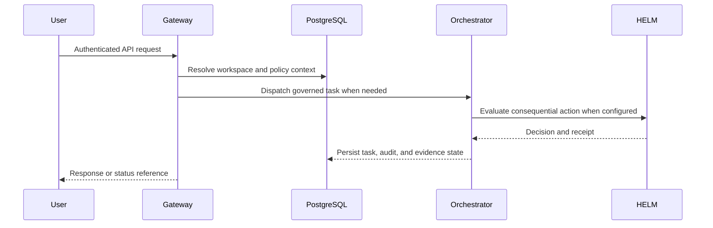

# Pilot Backend and Protocols

This page is the public backend map for Pilot. It keeps implementation-facing
readers oriented without duplicating the API reference or internal source-owner
READMEs.

## Source truth

- HTTP API behavior: `docs/api.md` and `services/gateway/src/routes/`.
- Orchestration behavior: `services/orchestrator/README.md` and
  `services/orchestrator/src/`.
- Shared contracts and sanitizers: `packages/shared/README.md`.
- Database domains and migrations: `packages/db/README.md` and
  `packages/db/migrations/README.md`.
- HELM integration: `docs/helm-integration.md` and `packages/helm-client/README.md`.
- Connector behavior: `docs/integrations.md` and `packages/connectors/README.md`.

## Backend boundary

The gateway owns HTTP ingress, authentication, workspace context, rate limiting,
and route-level validation. The orchestrator owns task execution, agent loop
coordination, tool mediation, and governance handoff. Database schema docs are
source maps, not product promises; capability promotion remains governed by the
shared capability registry and production-readiness evidence.

## Request path

## Validation

Run `npm run docs:coverage && npm run docs:truth` before changing backend docs.
Use the route tests in `services/gateway` and orchestrator tests for behavioral
claims.
