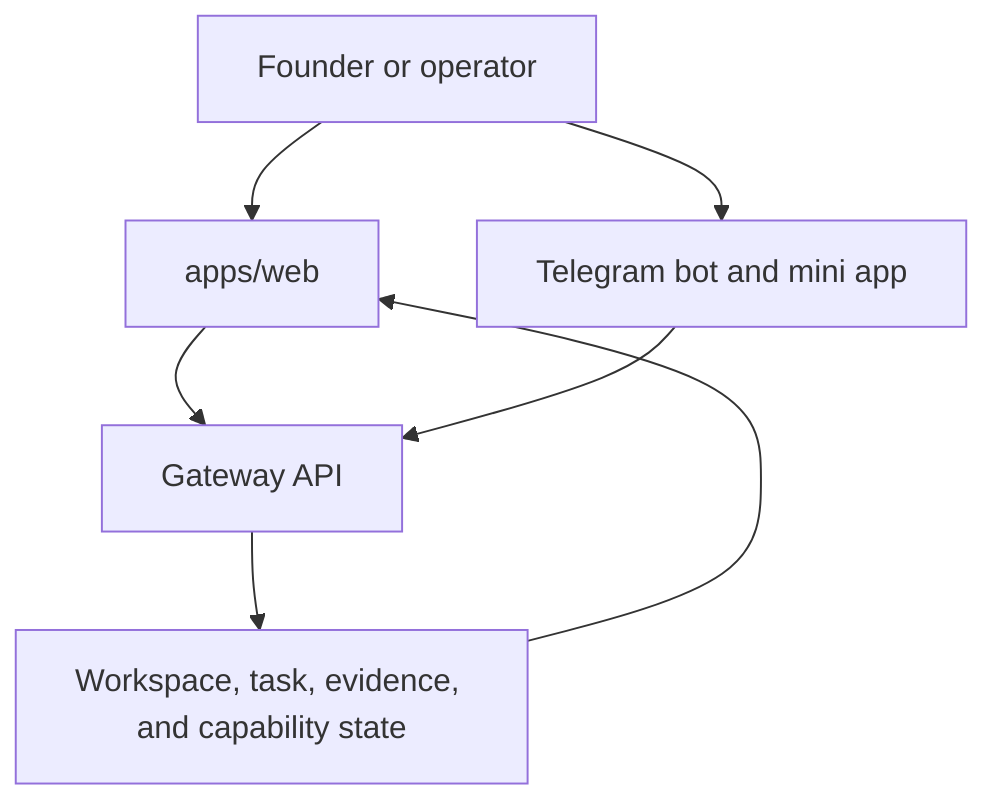

# Pilot Frontend and Console

This page is the public frontend map for Pilot. It covers user-facing surfaces
and points readers to the implementation paths that own behavior.

## Source truth

- Web application shell and founder workflows: `apps/web/README.md` and
  `apps/web/src/app/`.
- Telegram Mini App behavior: `docs/telegram-miniapp-8.md` and
  `apps/telegram-miniapp/README.md`.
- Telegram bot behavior: `apps/telegram-bot/README.md`.
- Public workflow routes and capability labels: `docs/capabilities.md`,
  `docs/pilot-capability-matrix.md`, and the shared capability registry.
- API payloads used by UI surfaces: `docs/api.md`.

## Frontend boundary

Pilot frontend docs may describe available screens, route families, and the
state each screen reads. They must not promote prototype or implemented
capabilities to production-ready unless the shared registry and evidence-backed
evals have already promoted the capability.

## Surface map

## Validation

Run `npm run docs:coverage && npm run docs:truth` before changing frontend docs.
Run the relevant web or Telegram package checks when a UI claim depends on
actual route behavior.
