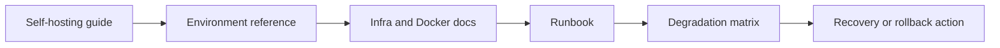

# Pilot Platform and DevOps

This page is the public platform map for Pilot. It is intentionally narrow:
deployment, operations, infrastructure prerequisites, and recovery paths. Product
workflow behavior belongs in `docs/architecture.md`, API details belong in
`docs/api.md`, and environment variables belong in `docs/env-reference.md`.

## Source truth

- Local and production deployment: `docs/self-hosting.md`, `infra/README.md`,
  `infra/digitalocean/README.md`, and `infra/docker/README.md`.
- Runtime operation and incident response: `docs/runbook.md`,
  `docs/degradation-matrix.md`, and `infra/monitoring/README.md`.
- Configuration: `docs/env-reference.md` and `.env.example`.
- Migration safety: `packages/db/migrations/README.md` and
  `scripts/check-migration-journal.ts`.

## Platform boundary

Pilot runs as a self-hosted stack: web UI, gateway, orchestrator, PostgreSQL,
pgvector, background jobs, optional Telegram surfaces, and optional HELM
governance. The platform docs should explain how to run, observe, back up, and
upgrade that stack. They should not claim managed hosting, production
availability, or customer deployment status unless a release artifact and smoke
evidence prove it.

## Public operator path

## Validation

Run `npm run docs:coverage && npm run docs:truth` before publishing platform
claims. Run `npm run compose:config` when changing Docker or DigitalOcean
deployment instructions.
