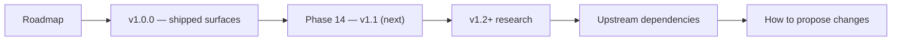

# Pilot — Public roadmap

## Diagram

This scheme maps the main sections of Roadmap in reading order.

Snapshot as of the v1.0.0-rc cut. Items marked (🟢) ship in v1.0.0;
(🟡) defer to v1.1 / Phase 14; (🔵) longer-range research.

Production-readiness source of truth: this roadmap is not a production autonomy claim. Use [`docs/capabilities.md`](capabilities.md), `GET /api/capabilities`, and `packages/shared/src/capabilities/index.ts` for current capability state. A shipped surface may still be `prototype`, `scaffolded`, `stub`, or `blocked` until it passes the required eval and the registry marks it `production_ready`.

## v1.0.0 — shipped surfaces

- 🟢 HELM governance sidecar integration with signed evidence packs
- 🟢 Multi-tenant isolation + per-tenant secrets + rate-limit partitioning + per-tenant backup
- 🟢 Discover mode: YC + HN + ProductHunt + IndieHackers + GitHub trending + Reddit r/SaaS + Crunchbase RSS + YC blog intelligence pipeline
- 🟢 Decide mode: adversarial decision court with bull/bear/referee/scenarios and cofounder matching
- 🟢 Build mode: spec generation + scaffolding templates + HELM-governed GitHub commits
- 🟢 Launch mode: DigitalOcean deploy target with guarded deploy receipts
- 🟢 Apply mode: YC/Techstars/Antler templates with HELM-escalated submissions
- 🟢 Governance surface: receipts list + proof-graph DAG viewer + `dump-proof-graph.ts` CLI
- 🟢 Governed subagents: Conductor + three built-ins (opportunity_scout, decision_facilitator, founder_diagnostician)
- 🟢 Observability: OTel GenAI semantic conventions, 5 Alertmanager-routed alerts, Grafana GenAI dashboard
- 🟢 Supply-chain hardening: CycloneDX SBOM, SLSA L3 provenance, Trivy + gitleaks + license gates

## Phase 14 — v1.1 (next)

- 🟡 Vercel launch provider parity and deeper DigitalOcean automation
- 🟡 `decision_court_run` tool wrapper enabling `decision_facilitator` to invoke the full court
- 🟡 Four more built-in subagents: `build_engineer`, `launch_captain`, `application_drafter`, plus governed wrappers around the SMTM-Phase-11 ops (`content_strategist`, `seo_analyst`, `ads_operator`, `social_operator`, `finance_ops_lead`)
- 🟡 Interactive DAG replay — re-execute an evidence-pack node with modified inputs (diff-render the new subtree)
- 🟡 Mini App full per-mode tabs (decide / launch / apply / governance) + operator chat wired to SSE
- 🟡 Playwright docker-stack shared fixture + 10 more E2E cases (build-spec, launch-deploy, apply-yc, helm-down, reauth, discover-flow)
- 🟡 `dump-proof-graph` artifact generation wired into the landing-page demo

## v1.2+ research

- 🔵 Dynamic subagent creation from chat (registry currently loads from disk only)
- 🔵 MCP server attachment on subagents (`mcp_servers:` frontmatter currently ignored)
- 🔵 Streaming partial subagent results back to the parent
- 🔵 Subagent marketplace + remote hosting
- 🔵 Policy-pack marketplace (v1 ships with a single `founder_ops` pack)
- 🔵 Advanced compliance overlays: GDPR, HIPAA, SOX
- 🔵 Multi-region deployment (v1 is single-region)
- 🔵 Enterprise SSO (SAML/OIDC)
- 🔵 Cross-workspace subagent / cofounder-candidate search

## Upstream dependencies

- `helm-ai-kernel` governance parity — keep `POST /api/v1/evaluate` and the `/api/v1/guardian/evaluate` compatibility alias covered by contract tests; migration `0012_reverify_spawn_receipts.sql` remains available for re-signing older Path-A rows.

## How to propose changes

Open an issue via `.github/ISSUE_TEMPLATE/feature.md`. Roadmap changes of significance (reorderings, removals) require a PR against `docs/roadmap.md` with a Why / How-to-apply paragraph so the rationale survives the next snapshot.
